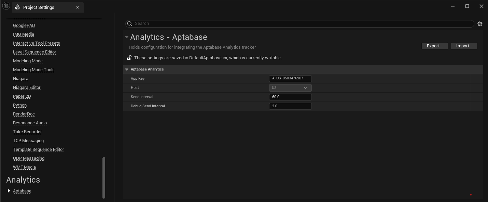
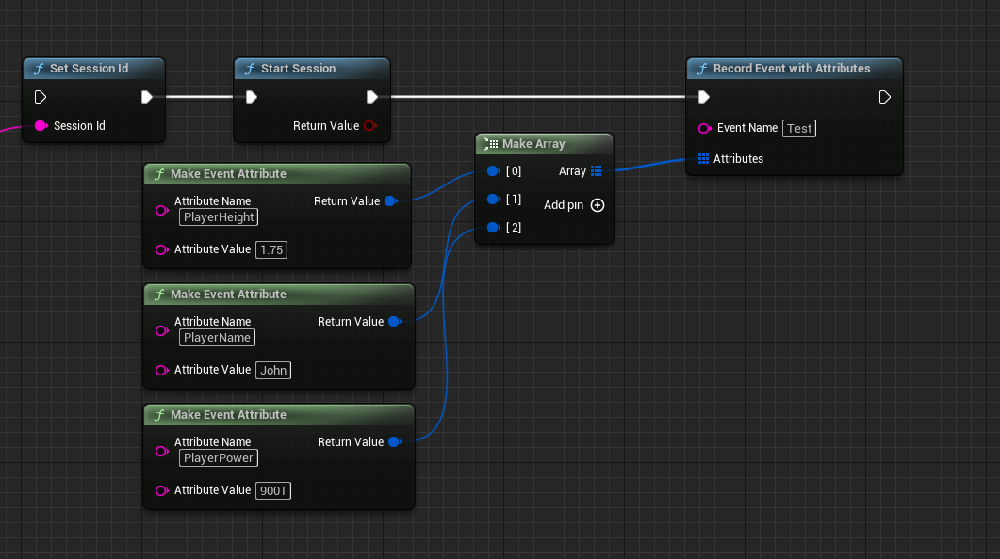
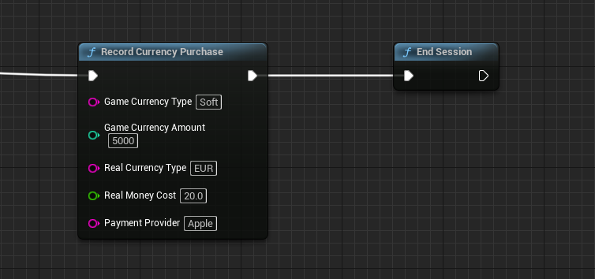

# Unreal Engine SDK for Aptabase

Instrument your Unreal Engine project with Aptabase, an Open Source, Privacy-First and Simple Analytics for Mobile, Desktop and Web Apps.

## Install

Install the SDK via the [Unreal Marketplace](https://github.com/aptabase/aptabase-unreal/issues/2) or clone this repository inside your `Plugins` folder and compile it (requires C++ based project).

## Enabling

The first thing you will need to do is to enable the plugin in your project.

1. Navigate to `Toolbar menu → Edit → Plugins` and open the `Plugins` tab.
1. Search for `Aptabase`.
1. Enable the `Aptabase` plugin.
1. Press on the `Restart now` pop-up button or restart your project manually.

## Provider setup

Inside the `Config/DefaultEngine.ini` file add the following lines:

```
[Analytics]
ProviderModuleName=Aptabase
```

**Note**: If you already have a different Analytics provider, you will have to replace it with `Aptabase` or use the [Multicast Analytics Provider Plugin](https://docs.unrealengine.com/4.26/en-US/TestingAndOptimization/Analytics/Multicast/) to run multiple in parallel.

## Project settings

First, you need to get your `App Key` from Aptabase, you can find it in the `Instructions` menu on the left side menu.

Then you have to set it inside `Project Settings → Analytics → Aptabase` inside your `App Key` field.

Based on the key, your `Host` will be selected. In the case of self-hosted versions, you will get an input field to enter your custom URL.

Also, here you can adjust how often events will be sent to the backend.

**Send Interval** is used in *Release Mode*, while **Debug Send Interval** is used in *Debug Mode*. Both are measured in seconds.



## Usage

### Blueprints

**Note**: To simplify tracking events, I highly encourage using the [Blueprint Analytics Plugin](https://docs.unrealengine.com/4.27/en-US/TestingAndOptimization/Analytics/Blueprints/). This allows you to track events in a provider-agnostic way.

Aptabase supports all methods of analytics implementation. You can track your custom events using `Record Event with Attributes`



Or take advantage of the pre-existing more complex calls with nodes like `Record Currency Purchase`.



### C++

The same applies to a C++ implementation. We suggest using `FAnalytics` modules to keep implementation provider-agnostic.

Similar to blueprints you can track events using simple `Record Event with Attributes`

```c++
TArray<FAnalyticsEventAttribute> Attributes;
Attributes.Emplace(TEXT("PlayerHeight"), 1.75);
Attributes.Emplace(TEXT("PlayerName"), TEXT("John"));
Attributes.Emplace(TEXT("PlayerPower"), 9001);

FAnalytics::Get().GetDefaultConfiguredProvider()->RecordEvent(TEXT("Test"), Attributes);
```

or more complex calls like `Record Currency Purchase`.

```c++
FAnalytics::Get().GetDefaultConfiguredProvider()->RecordCurrencyPurchase(TEXT("Soft"), 5000, TEXT("EUR"), 20.0, TEXT("Apple"));
```

A few important notes:

1. The SDK will automatically enhance the event with some useful information, like the OS, the app version, and other things.
2. You're in control of what gets sent to Aptabase. This SDK does not automatically track any events, you need to record events manually.
   - Because of this, it's generally recommended to at least track an event at startup
3. You do not need to await for the record event calls, they will run in the background.
4. Only strings and numbers values are allowed on custom properties

## Error Reporting

Error reporting is in beta. Reports appear on the **Errors** page of your Aptabase dashboard.

Start an analytics session using the **Start Session** Blueprint node or your configured provider's `StartSession()` before tracking events or errors. End it with **End Session** / `EndSession()` when your game session ends.

### C++

Add `"Aptabase"` to your game's `Build.cs` dependencies and call the API on the game thread:

```cpp
#include "AptabaseBlueprintLibrary.h"

UAptabaseBlueprintLibrary::TrackError(
    TEXT("Could not save the game"), TEXT("SaveError"));

// Supply the original stack trace when available. Fatal means the app cannot recover;
// setting it does not terminate the app.
UAptabaseBlueprintLibrary::TrackError(
    TEXT("Required assets are missing"), TEXT("LoadError"), TEXT("LoadAssets\nStartGame"), true);
```

Manual reports have severity `error` and kind `handled`. With `bFatal = true`, they have severity `fatal` and kind `crash`. The message, type, and optional stack are sent with the session ID, capture timestamp, OS, app/SDK versions, and debug/release mode. Empty error types default to `Error`.

### Blueprints

Use **Track Error** under **Analytics → Aptabase**. Set **Error Message** and **Error Type**; expand the advanced pins for **Stack Trace** and **Fatal**. The node uses Aptabase's own provider instance and also works when Aptabase is configured through the Multicast provider.

### Automatic crash reporting

Enable **Project Settings → Analytics → Aptabase → Enable Crash Reporting** before starting the session, or add this to `Config/DefaultAptabase.ini`:

```ini
[/Script/Aptabase.AptabaseSettings]
bEnableCrashReporting=True
```

This is off by default. While enabled, fatal errors that reach the engine's error handler during an active session are reported as `crash`/`fatal`: `check` and `verify` assertion failures, `UE_LOG` messages at `Fatal` verbosity, `LowLevelFatalError`, and unhandled native exceptions or signals on platforms where the engine routes them through its error handler. The report is built from the engine's error state: the heading becomes the error type (`AssertionFailed`, `FatalError`, `UnhandledException`, or the signal name such as `SIGSEGV` for a native crash on Apple and Unix platforms), the description becomes the message and the engine's call stack is included.

Non-fatal `Error` log messages are never reported automatically. Use **Track Error** for errors your game detects itself.

Delivery of crash reports is best effort. The process is terminating, so the error handler writes the report to `Saved/Aptabase/Crashes` and the next session start sends the pending reports, each under the session in which the crash happened. The newest 10 pending reports are kept; a report is deleted once the server accepts or permanently rejects it, so an offline launch keeps it for a later one. On Windows the handler also tries to send the report immediately with a 3 second timeout, because the engine handles the crash on a separate thread while the HTTP thread keeps running; a report delivered this way is not sent again. On macOS, iOS and Linux the engine switches to a crash allocator that suspends every other thread, including the HTTP thread, so crash reports always arrive at the next launch. Nothing is captured when the crash corrupts the process beyond what the engine's handler survives. Unreal's own Crash Reporter remains available and is unaffected.

Errors and crashes that happen before `StartSession()` or after `EndSession()` are not captured. Start the session as early as your game can, for example in your `GameInstance::Init`.

### Delivery

- Manual reports are sent asynchronously, one per request. Capturing an error schedules an immediate send on the game thread; `FlushEvents()` and the normal send timer also flush errors. Crash reports are written to disk from the error handler and queued for sending at the next session start, as described above.
- Failed requests are retained for a later flush on connection errors or HTTP 408, 429, and 5xx. Other responses, including HTTP 403 (monthly quota exhausted), are not retried.
- The queue holds up to 25 outstanding reports, including requests in progress. New reports are dropped when full. Each unique combination of kind, type, message, and stack is reported once per session, up to 100 unique reports.
- Retries retain their original session and system context. Manual reports are stored in memory only and can be lost when the process exits; crash reports are persisted until delivered or permanently rejected. Ending a session initiates a final flush without waiting for delivery.
- Error text can contain application data. Only include information you intend to send to Aptabase.

See [testing instructions](Docs/testing.md) for the Unreal automation suite.

## Preparing for Submission to Apple App Store

When submitting your app to the Apple App Store, you'll need to fill out the `App Privacy` form. You can find all the answers on our [How to fill out the Apple App Privacy when using Aptabase](https://aptabase.com/docs/apple-app-privacy) guide.

For AI/LLM integration instructions, see [llms.txt](./llms.txt)
