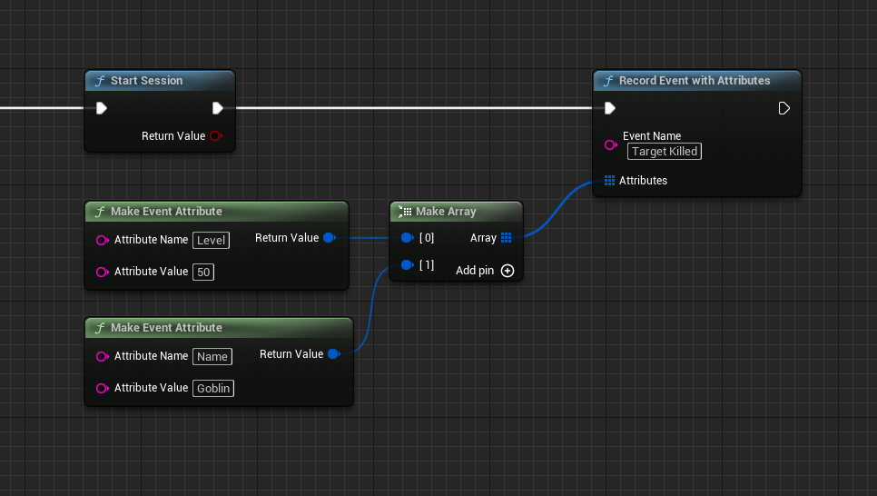

# Unreal Engine SDK for Aptabase

Instrument your Unreal Engine project with Aptabase, an Open Source, Privacy-First and Simple Analytics for Mobile, Desktop and Web Apps.

## Install

Install the SDK via the [Unreal Marketplace](https://github.com/aptabase/aptabase-unreal/issues/2) or clone this repository inside your `Plugins` folder and compile it (requires C++ based project).

## Enabling

The first thing you will need to do is to enable the plugin in your project.

1. Navigate to `Toolbar menu → Edit → Plugins` and open the `Plugins` tab.
1. Search for `Aptabase`.
1. Enable the `Aptabase` plugin.
1. Press on the `Restart now` pop-up button or restart your project manually.

## Provider setup

Inside the `Config/DefaultEngine.ini` file add the following lines:

```
[Analytics]
ProviderModuleName=Aptabase
```

**Note**: If you already have a different Analytics provider, you will have to replace it with `Aptabase` or use the [Multicast Analytics Provider Plugin](https://docs.unrealengine.com/4.26/en-US/TestingAndOptimization/Analytics/Multicast/) to run multiple in parallel.

## Project settings

First, you need to get your `App Key` from Aptabase, you can find it in the `Instructions` menu on the left side menu.

Then you have to set it inside `Project Settings → Analytics → Aptabase` inside your `App Key` field.

Based on the key, your `Host` will be selected. In the case of self-hosted versions, you will get an input field to enter your custom URL.


## Usage

### Blueprints

**Note**: To simplify tracking events, I highly encourage using the [Blueprint Analytics Plugin](https://docs.unrealengine.com/4.27/en-US/TestingAndOptimization/Analytics/Blueprints/). This allows you to track events in a provider-agnostic way.

Aptabase supports all methods of analytics implementation. You can track your custom events using `Record Event with Attributes`



Or take advantage of the pre-existing more complex calls with nodes like `Record Currency Purchase`.


### C++

The same applies to a C++ implementation. We suggest using `FAnalytics` modules to keep implementation provider-agnostic.

Similar to blueprints you can track events using simple `Record Event with Attributes`

```c++
TArray<FAnalyticsEventAttribute> Attributes;
Attributes.Emplace(TEXT("PlayerHeight"), 1.75);
Attributes.Emplace(TEXT("PlayerName"), TEXT("John"));
Attributes.Emplace(TEXT("PlayerPower"), 9001);

FAnalytics::Get().GetDefaultConfiguredProvider()->RecordError(TEXT("Test"), Attributes);
```

or more complex calls like `Record Currency Purchase`.

```c++
FAnalytics::Get().GetDefaultConfiguredProvider()->RecordCurrencyPurchase(TEXT("Soft"), 5000, TEXT("EUR"), 20.0, TEXT("Apple"));
```

A few important notes:

1. The SDK will automatically enhance the event with some useful information, like the OS, the app version, and other things.
2. You're in control of what gets sent to Aptabase. This SDK does not automatically track any events, you need to record events manually.
   - Because of this, it's generally recommended to at least track an event at startup
3. You do not need to await the record event calls, they will run in the background.
4. Only strings and numbers values are allowed on custom properties

## Preparing for Submission to Apple App Store

When submitting your app to the Apple App Store, you'll need to fill out the `App Privacy` form. You can find all the answers on our [How to fill out the Apple App Privacy when using Aptabase](https://aptabase.com/docs/apple-app-privacy) guide.

